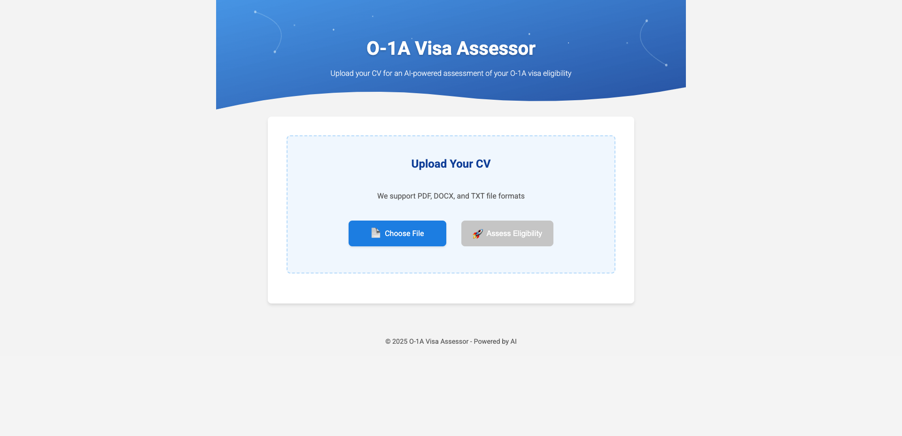

# O-1A Visa Assessor

An AI-powered tool that assesses eligibility for O-1A visa applications by analyzing CVs and resumes.



## Features

- Upload your CV/resume in PDF, DOCX, or TXT format
- AI-powered assessment of O-1A visa criteria matches
- Detailed breakdown of qualification with evidence
- Personalized recommendations to improve your application
- Modern, responsive UI for desktop and mobile

## Tech Stack

- **Frontend**:
  - React 18 with TypeScript
  - React Scripts for build tooling
  - Modern responsive design
- **Backend**:
  - FastAPI (Python)
  - OpenAI integration for AI-powered analysis
  - Document parsing (PDF, DOCX, TXT) with PyPDF2 and python-docx
  - Pydantic for data validation
- **Deployment**:
  - Docker and Docker Compose for containerization
  - Uvicorn ASGI server
- **Development Tools**:
  - Environment variable management with python-dotenv
  - TypeScript for type safety

## Getting Started

### Prerequisites

- Docker and Docker Compose

### Running the Application

1. Clone the repository
2. Create a `.env` file with required environment variables
3. Start the application:

```bash
docker-compose up
```

4. Open your browser and go to `http://localhost:3000`

## API Documentation

API documentation is available at `http://localhost:8000/docs` when the application is running.

## Development

### Frontend Development

```bash
cd frontend
npm install
npm start
```

### Backend Development

```bash
cd app
pip install -r requirements.txt
python -m uvicorn app.app:app --reload
```

### Docker Development

```bash
cd app
docker compose up --build -d
```

## License

MIT License

## Acknowledgments

- [FastAPI](https://fastapi.tiangolo.com/)
- [React](https://reactjs.org/)
- [Docker](https://www.docker.com/)
